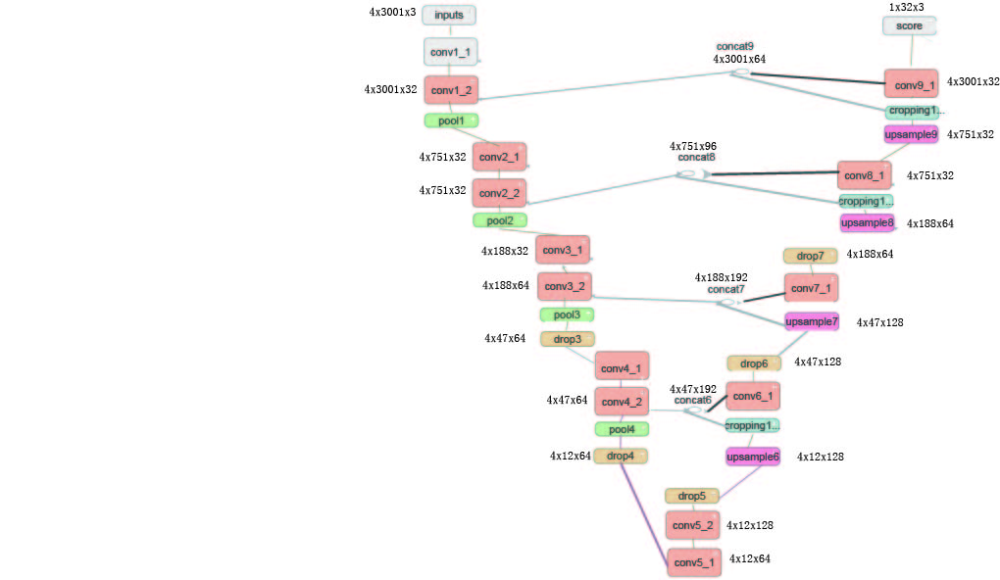
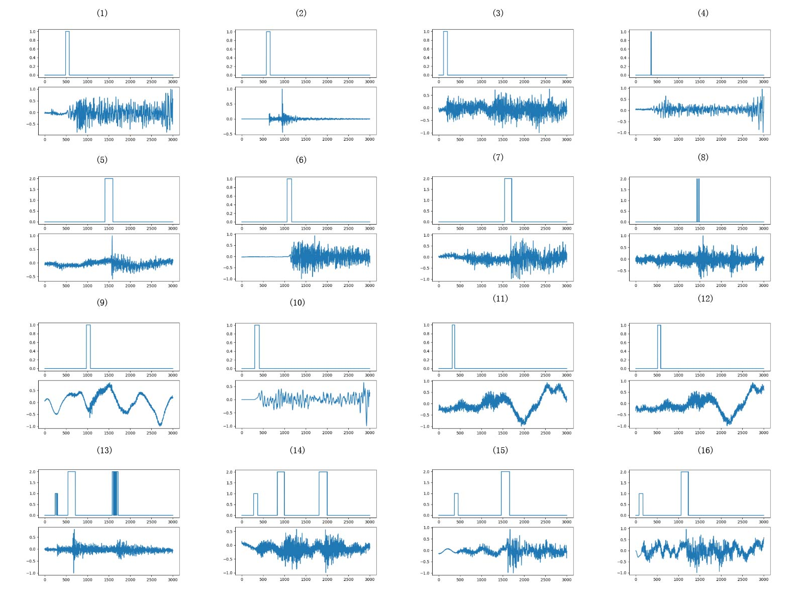
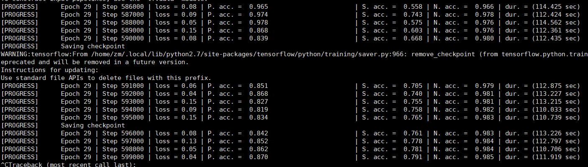

# unet_cea
Using Unet to train model based on wenchuan aftershocks and automatically detect p,s phases
============= 

This is the unet code used in the paper:
赵明，陈石，房立华，David A Yuen. 2019. 基于U形全卷积神经网络的震相识别与到时拾取方法研究. 地球物理学报，待刊.

And,it is developed from ConvNetQuake :
Perol., T, M. Gharbi and M. Denolle. Convolutional Neural Network for Earthquake detection and location. [preprint arXiv:1702.02073](https://arxiv.org/abs/1702.02073), 2017.

The u-net structure

The example of labeled sample:

Some detect results

Some train snapshots

## Installation
* Install dependencies: `conda env create -f unet_cea python27.yaml`

## Train

python ./bin/unet_train.py --tfrecords_dir data/train/  --checkpoint_dir model

## Tensorboard for real-time monitor

tensorboard --logdir model

## Trained model
An trained model on Chinese Metropolitian Network(178 stations,266350 samples),thanks to  Hebei Earthquake Administration for providing the catalogs and high accuracy manual picks 
The directory `unet_capital`

## validate
python ./bin/unet_eval.py --tfrecords_dir data/test --checkpoint_path output/unet_capital/  --batch_size 1000 --output_dir output/unet --events

(more to come) 
